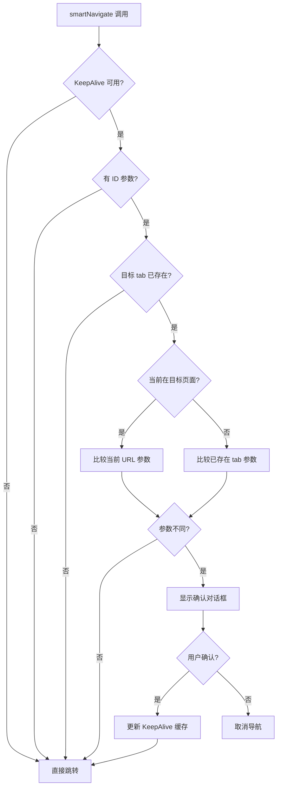

# SmartNavigation API 参考文档

## 📋 目录

- [类型定义](#类型定义)
- [Hooks](#hooks)
- [工具函数](#工具函数)
- [配置接口](#配置接口)
- [内部机制](#内部机制)

## 🔧 类型定义

### SmartNavigationConfig

智能导航配置接口，定义了所有可配置的选项。

```tsx
interface SmartNavigationConfig {
  /** 目标路径 */
  targetPath: string;
  /** 新的参数对象 */
  newParams?: Record<string, any>;
  /** 确认对话框标题 */
  confirmTitle?: string;
  /** 确认对话框内容模板，支持变量：{currentId}、{newId} */
  confirmContent?: string;
  /** 确认按钮文本 */
  okText?: string;
  /** 取消按钮文本 */
  cancelText?: string;
  /** 是否启用调试日志 */
  debug?: boolean;
}
```

**参数详解：**

| 参数 | 类型 | 必需 | 默认值 | 描述 |
|------|------|------|--------|------|
| `targetPath` | `string` | ✅ | - | 要导航到的目标路径，必须是完整的路由路径 |
| `newParams` | `Record<string, any>` | ❌ | `{}` | URL查询参数对象，会被转换为查询字符串 |
| `confirmTitle` | `string` | ❌ | `'切换编辑记录确认'` | 确认对话框的标题文本 |
| `confirmContent` | `string` | ❌ | `'检测到已有该表单页面打开编辑记录 {currentId}，是否要切换到编辑记录 {newId}？'` | 确认对话框的内容，支持模板变量 |
| `okText` | `string` | ❌ | `'是，切换'` | 确认按钮的文本 |
| `cancelText` | `string` | ❌ | `'否，取消'` | 取消按钮的文本 |
| `debug` | `boolean` | ❌ | `false` | 是否在控制台输出调试信息 |

**模板变量：**

在 `confirmContent` 中可以使用以下变量：

- `{currentId}` - 当前页面的ID参数（取后8位）
- `{newId}` - 新请求的ID参数（取后8位）

## 🎣 Hooks

### useSmartNavigation

智能导航的主要Hook，返回配置化的导航函数。

```tsx
const smartNavigate = useSmartNavigation();
```

**返回值：**
- `smartNavigate: (config: SmartNavigationConfig) => void` - 智能导航函数

**使用示例：**
```tsx
import { useSmartNavigation } from '@/components/smartNavigation';

const MyComponent = () => {
  const smartNavigate = useSmartNavigation();
  
  const handleEdit = (id: string) => {
    smartNavigate({
      targetPath: '/edit',
      newParams: { id }
    });
  };
  
  return <Button onClick={() => handleEdit('123')}>编辑</Button>;
};
```

## 🔨 工具函数

### createSmartNavigate

创建一个使用默认配置的简化导航函数。

```tsx
const smartNavigate = createSmartNavigate(debug?: boolean);
```

**参数：**
- `debug?: boolean` - 是否启用调试模式，默认 `false`

**返回值：**
- `(targetPath: string, newParams?: Record<string, any>) => void` - 简化的导航函数

**使用示例：**
```tsx
import { createSmartNavigate } from '@/components/smartNavigation';

// 创建导航函数
const navigate = createSmartNavigate(true); // 启用调试

// 使用
const handleEdit = (id: string) => {
  navigate('/edit', { id });
};
```

## ⚙️ 配置接口

### 默认配置

```tsx
const DEFAULT_CONFIG = {
  confirmTitle: '切换编辑记录确认',
  confirmContent: '检测到已有该表单页面打开编辑记录 {currentId}，是否要切换到编辑记录 {newId}？',
  okText: '是，切换',
  cancelText: '否，取消',
  debug: false
};
```

### 环境变量

组件会自动检测以下环境变量：

- `process.env.NODE_ENV` - 在开发环境下可能启用更详细的调试信息

## 🔍 内部机制

### 导航决策流程



### KeepAlive 缓存更新

当用户确认切换时，组件会执行以下步骤：

1. **获取现有 tab 的 location 信息**
2. **构建新的 location 对象**
3. **调用 KeepAlive 的 updateTab 方法**
4. **执行实际的路由跳转**

```tsx
// 内部实现示例
const updateTabLocation = (targetPathLower, targetPath, searchParams, existingTab) => {
  if (keepAliveContext?.updateTab) {
    const newLocation = {
      ...existingTab.location,
      search: searchParams.toString() ? `?${searchParams.toString()}` : '',
      pathname: targetPath
    };
    
    keepAliveContext.updateTab(targetPathLower, {
      location: newLocation
    });
  }
};
```

### 调试信息

启用 `debug: true` 时，控制台会输出以下信息：

```typescript
// 导航检查
console.log('[SmartNavigation] 智能导航检查:', {
  targetPath,
  newParams,
  newUrl,
  currentPath,
  openedTabs
});

// 参数比较
console.log('[SmartNavigation] 当前在目标表单页面，参数比较:', {
  currentId,
  newId,
  currentUrl
});

// KeepAlive 更新
console.log('[SmartNavigation] 更新KeepAlive tab的location:', {
  oldLocation,
  newLocation
});
```

### 错误处理

组件内置了以下错误处理机制：

1. **KeepAlive 上下文检查** - 如果不可用，回退到直接跳转
2. **参数验证** - 自动过滤 `undefined` 和 `null` 值
3. **路径标准化** - 统一转换为小写进行比较
4. **安全的对象访问** - 使用可选链操作符避免错误

### 性能优化

- **路径缓存** - 避免重复的字符串处理
- **参数比较** - 只在必要时进行参数解析和比较
- **延迟执行** - 确认对话框只在需要时创建
- **内存清理** - 适当的引用管理避免内存泄漏

## 🧪 测试建议

### 单元测试

```tsx
describe('SmartNavigation', () => {
  it('should navigate directly when KeepAlive is not available', () => {
    // 测试逻辑
  });

  it('should show confirmation when parameters differ', () => {
    // 测试逻辑
  });

  it('should update KeepAlive cache correctly', () => {
    // 测试逻辑
  });
});
```

### 集成测试

1. **多 tab 切换测试**
2. **参数变化检测测试**
3. **KeepAlive 缓存更新测试**
4. **用户交互测试**

## 📚 相关资源

- [UmiJS KeepAlive 文档](https://umijs.org/docs/max/keep-alive)
- [React Router 文档](https://reactrouter.com/)
- [Ant Design Modal 组件](https://ant.design/components/modal-cn/)

## 🐛 已知限制

1. **路径匹配** - 目前只支持精确路径匹配，不支持通配符
2. **参数类型** - 只支持字符串类型的 URL 参数
3. **嵌套路由** - 对于复杂的嵌套路由支持有限
4. **浏览器兼容性** - 依赖现代浏览器的 URLSearchParams API

## 🔄 版本兼容性

| 版本 | React | UmiJS | Ant Design | 状态 |
|------|-------|--------|------------|------|
| 1.0.0 | >=18.0 | >=4.0 | >=5.0 | ✅ 支持 |